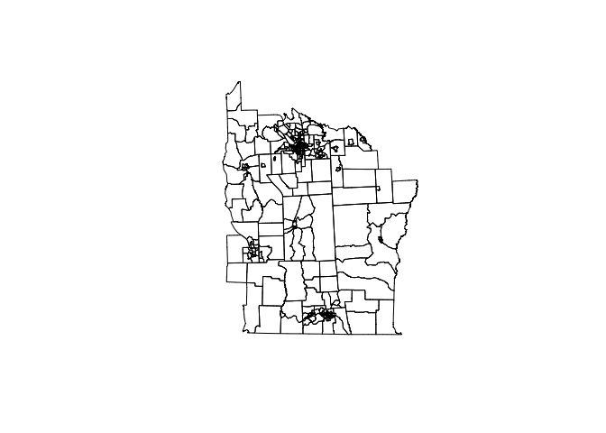
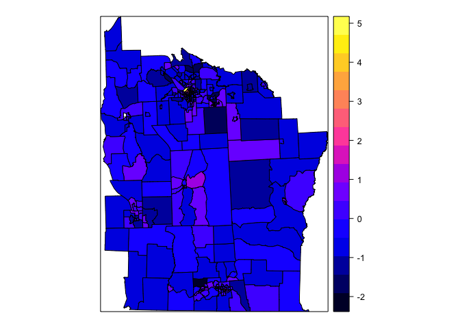
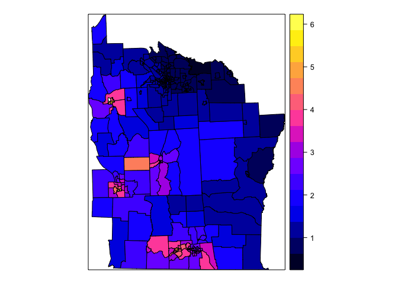
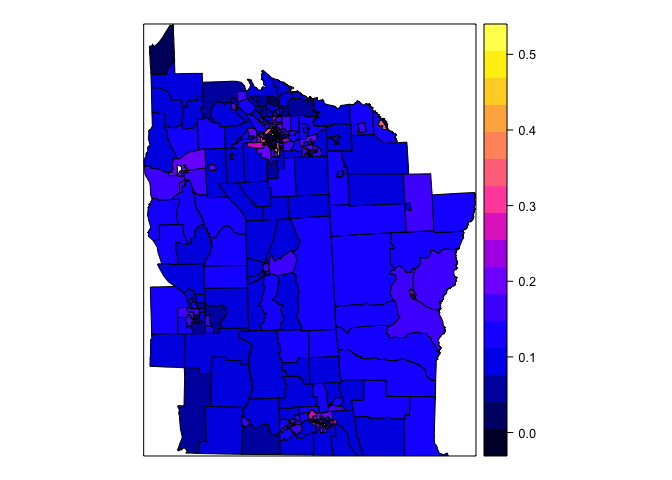
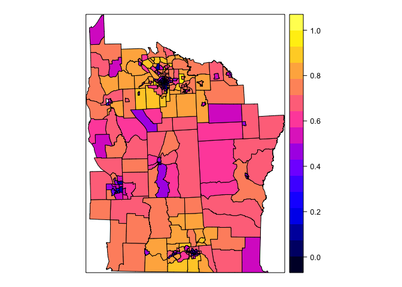
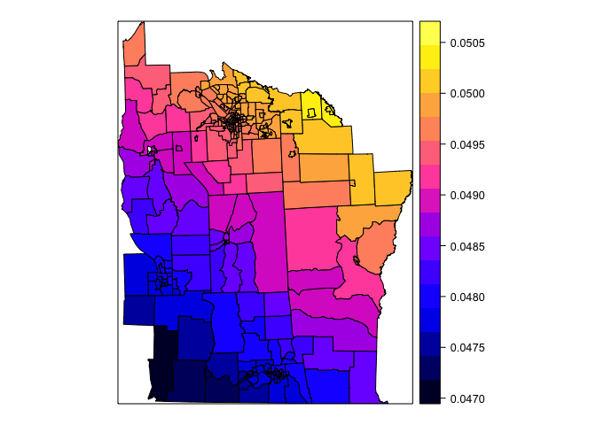
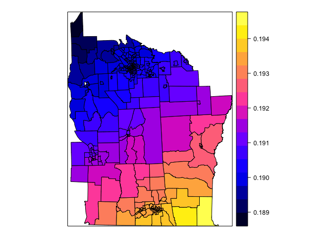

# Geographically Weighted Regression
Wen Fu  
April 24, 2016  
Spatial non-stationarity: the same stimulus provokes a different response in different parts of the study region.

This lab tests and visualizes non-stationarity in a model aimed at explaining variations in cancer prevalence in central NY by regressing it on amount of exposure (exposure to toxic release site) and controlling for age (% of those over 65) and SES (% of home owners).


```r
suppressPackageStartupMessages(library(maptools))
suppressPackageStartupMessages(library(spdep))
suppressPackageStartupMessages(library(spgwr))
suppressPackageStartupMessages(library(rgdal))
```

Load the shapefile and plot it.

```r
NY_GWR <- readShapeSpatial("NY shapefile")
plot(NY_GWR)
```



See the variables associated with the shapefile.

```r
names(NY_GWR)
```

```
##  [1] "AREANAME"   "AREAKEY"    "X"          "Y"          "POP8"      
##  [6] "TRACTCAS"   "PROPCAS"    "PCTOWNHOME" "PCTAGE65P"  "Z"         
## [11] "AVGIDIST"   "PEXPOSURE"  "Cases"      "Xm"         "Ym"        
## [16] "Xshift"     "Yshift"
```

Here, "Z" is our dependent variable indicating standardized cancer rate. Our independent variables are "PEXPOSURE", "PCTAGE65P" and "PCTOWNHOME". View each of these variables spatially.

```r
spplot(NY_GWR, "Z")
```



```r
spplot(NY_GWR, "PEXPOSURE")
```



```r
spplot(NY_GWR, "PCTAGE65P")
```



```r
spplot(NY_GWR, "PCTOWNHOME")
```



In order to examine for non-stationarity, need to identify the optimal bandwidth (bwG), which can be selected as the following.

```r
# Set weighting scheme as Gaussian (gweight) and ask for output to view (verbose = T)
bwG <- gwr.sel(Z ~ PEXPOSURE + PCTAGE65P + PCTOWNHOME, data = NY_GWR, gweight = gwr.Gauss, verbose = TRUE) 
```

```
## Bandwidth: 68843.15 CV score: 125.2543 
## Bandwidth: 111279.3 CV score: 124.7056 
## Bandwidth: 137506.4 CV score: 124.5702 
## Bandwidth: 147199.2 CV score: 124.5366 
## Bandwidth: 159706.1 CV score: 124.5016 
## Bandwidth: 167435.7 CV score: 124.4836 
## Bandwidth: 172212.9 CV score: 124.4737 
## Bandwidth: 175165.4 CV score: 124.4679 
## Bandwidth: 176990.1 CV score: 124.4645 
## Bandwidth: 178117.8 CV score: 124.4625 
## Bandwidth: 178814.8 CV score: 124.4612 
## Bandwidth: 179245.6 CV score: 124.4604 
## Bandwidth: 179511.8 CV score: 124.46 
## Bandwidth: 179676.3 CV score: 124.4597 
## Bandwidth: 179778 CV score: 124.4595 
## Bandwidth: 179840.9 CV score: 124.4594 
## Bandwidth: 179879.7 CV score: 124.4593 
## Bandwidth: 179903.7 CV score: 124.4593 
## Bandwidth: 179918.6 CV score: 124.4592 
## Bandwidth: 179927.7 CV score: 124.4592 
## Bandwidth: 179933.4 CV score: 124.4592 
## Bandwidth: 179936.9 CV score: 124.4592 
## Bandwidth: 179939.1 CV score: 124.4592 
## Bandwidth: 179940.4 CV score: 124.4592 
## Bandwidth: 179941.2 CV score: 124.4592 
## Bandwidth: 179941.7 CV score: 124.4592 
## Bandwidth: 179942 CV score: 124.4592 
## Bandwidth: 179942.2 CV score: 124.4592 
## Bandwidth: 179942.4 CV score: 124.4592 
## Bandwidth: 179942.4 CV score: 124.4592 
## Bandwidth: 179942.5 CV score: 124.4592 
## Bandwidth: 179942.5 CV score: 124.4592 
## Bandwidth: 179942.5 CV score: 124.4592 
## Bandwidth: 179942.5 CV score: 124.4592 
## Bandwidth: 179942.5 CV score: 124.4592 
## Bandwidth: 179942.5 CV score: 124.4592 
## Bandwidth: 179942.6 CV score: 124.4592 
## Bandwidth: 179942.6 CV score: 124.4592
```

```
## Warning in gwr.sel(Z ~ PEXPOSURE + PCTAGE65P + PCTOWNHOME, data = NY_GWR, :
## Bandwidth converged to upper bound:179942.556026147
```

Now, use this bandwidth to produce the result - estimate the regression model with the newly created bandwidth, a Gaussian weighting scheme. View the results.

```r
gwrG <- gwr(Z ~ PEXPOSURE + PCTAGE65P + PCTOWNHOME, data = NY_GWR, bandwidth = bwG, gweight = gwr.Gauss)
gwrG
```

```
## Call:
## gwr(formula = Z ~ PEXPOSURE + PCTAGE65P + PCTOWNHOME, data = NY_GWR, 
##     bandwidth = bwG, gweight = gwr.Gauss)
## Kernel function: gwr.Gauss 
## Fixed bandwidth: 179942.6 
## Summary of GWR coefficient estimates at data points:
##                  Min.  1st Qu.   Median  3rd Qu.     Max.  Global
## X.Intercept. -0.52220 -0.52070 -0.52020 -0.51440 -0.51110 -0.5173
## PEXPOSURE     0.04718  0.04803  0.04953  0.04972  0.05048  0.0488
## PCTAGE65P     3.91200  3.93400  3.95900  3.96200  3.98000  3.9509
## PCTOWNHOME   -0.55940 -0.55800 -0.55770 -0.55550 -0.55460 -0.5600
```

```r
names(gwrG)
```

```
##  [1] "SDF"       "lhat"      "lm"        "results"   "bandwidth"
##  [6] "adapt"     "hatmatrix" "gweight"   "gTSS"      "this.call"
## [11] "fp.given"  "timings"
```

```r
# View the names of the underlying spatial data frame (SDF)
names(gwrG$SDF) 
```

```
## [1] "sum.w"        "X.Intercept." "PEXPOSURE"    "PCTAGE65P"   
## [5] "PCTOWNHOME"   "gwr.e"        "pred"         "localR2"
```

Visualize the geographical variation in the slope of exposure ($b$ of "PEXPOSURE") and model fit (local R squared) in the SDF.

```r
spplot(gwrG$SDF, "PEXPOSURE")
```



```r
spplot(gwrG$SDF, "localR2")
```



If needed, write the results out to shapefile format for use in QGIS.

```r
writeSpatialShape(gwrG$SDF, "GWR_Results")
```

