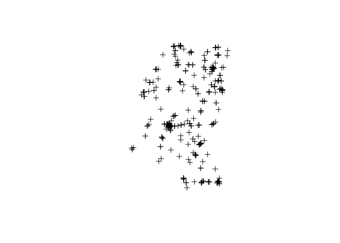
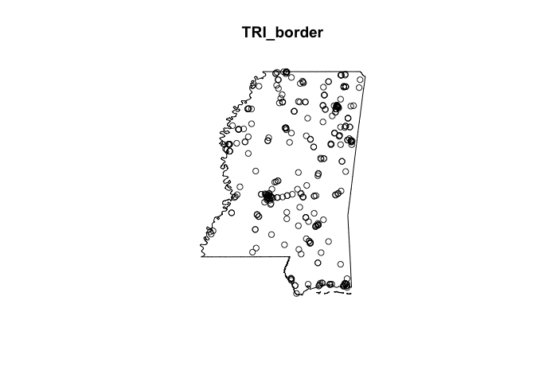
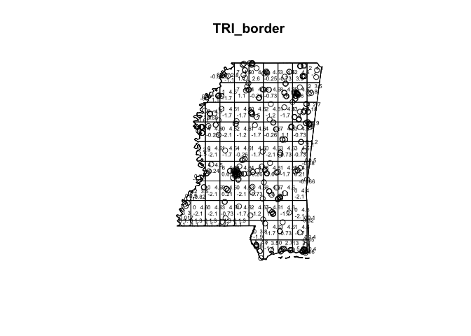
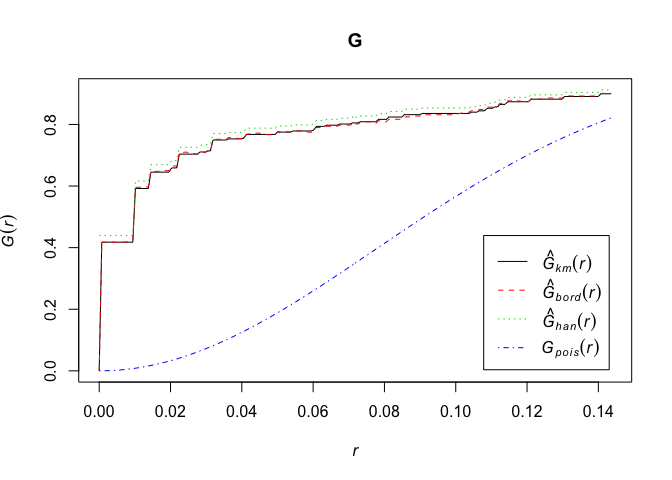
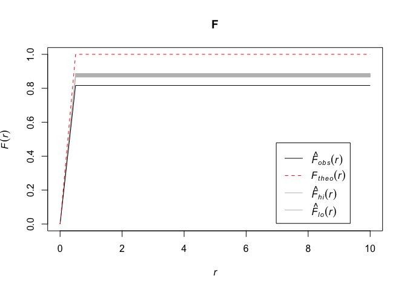
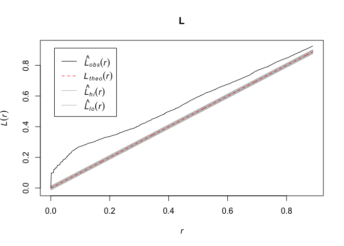

# Point Pattern Analysis in R
Wen Fu  
February 18, 2016  
1. Load packages

```r
#setwd()

suppressMessages(library(maptools))
suppressMessages(library(rgdal))
suppressMessages(library(shapefiles))
suppressMessages(library(spatstat))
```

```
## Warning: package 'spatstat' was built under R version 3.2.3
```

```r
suppressMessages(library(splancs))
suppressMessages(library(sp))
```

2. Read .shp file into R for splancs

```r
TRI <- readShapePoints("MS_TRI")
TRI_Coords <- coordinates(TRI)
border <- readShapePoly(paste("ms_dissolve", sep=""))
MSbord <- border@polygons[[1]]@Polygons[[1]]@coords

plot(TRI)
```

 

```r
plot(border)
```

 

3. Read .shp file into R for spatstat

```r
border2 <- readShapePoly("ms_dissolve")
boundry <- as(border2, "owin")
TRI2 <- readShapePoints("MS_TRI")
TRIpts <- as(TRI2, "ppp")
TRI_border <- ppp(TRIpts$x, TRIpts$y, window = boundry)
```

```
## Warning in ppp(TRIpts$x, TRIpts$y, window = boundry): data contain
## duplicated points
```

```r
plot(TRI_border, axes = T)
```

 

4. Quadrat method of exploring complete spatial randomness (CSR) of the point pattern

```r
qt <- quadrat.test(TRI_border, nx = 10, ny = 10)
```

```
## Warning: Some expected counts are small; chi^2 approximation may be
## inaccurate
```

```r
qt
```

```
## 
## 	Chi-squared test of CSR using quadrat counts
## 	Pearson X2 statistic
## 
## data:  TRI_border
## X2 = 473.72, df = 87, p-value < 2.2e-16
## alternative hypothesis: two.sided
## 
## Quadrats: 88 tiles (irregular windows)
```

```r
plot(TRI_border)
plot(qt, add = T, cex = .5)
```

 

5. G estimate in R

```r
G<-Gest(as(TRI_border, "ppp"))

plot(G)
```

 

6. F estimate in R

```r
r <- seq(0, 10, by = 0.5)
F <- envelope(TRI_border, Fest, r = r, nsim = 10, rank = 2)
```

```
## Generating 10 simulations of CSR  ...
## 1, 2, 3, 4, 5, 6, 7, 8, 9,  10.
## 
## Done.
```

```r
plot(F)
```

 

7. K function in R 

```r
L <- envelope(TRI_border, Lest, nsim = 10, rank = 2, global = T)
```

```
## Generating 10 simulations of CSR  ...
## 1, 2, 3, 4, 5, 6, 7, 8, 9,  10.
## 
## Done.
```

```r
plot(L)
```

 
