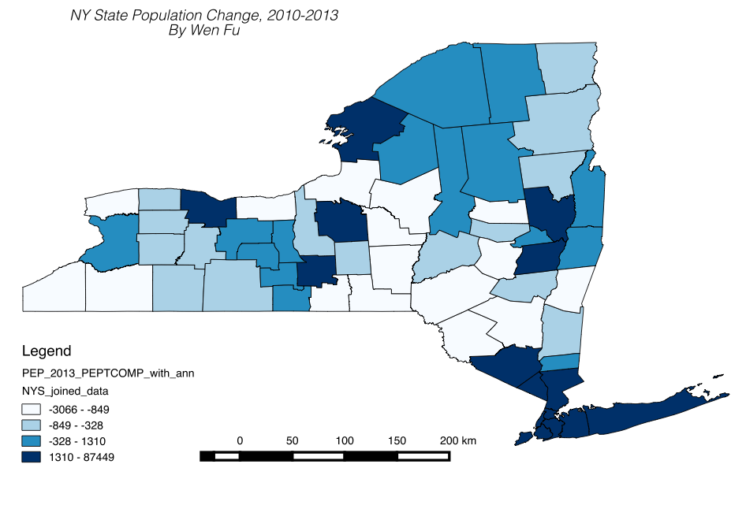
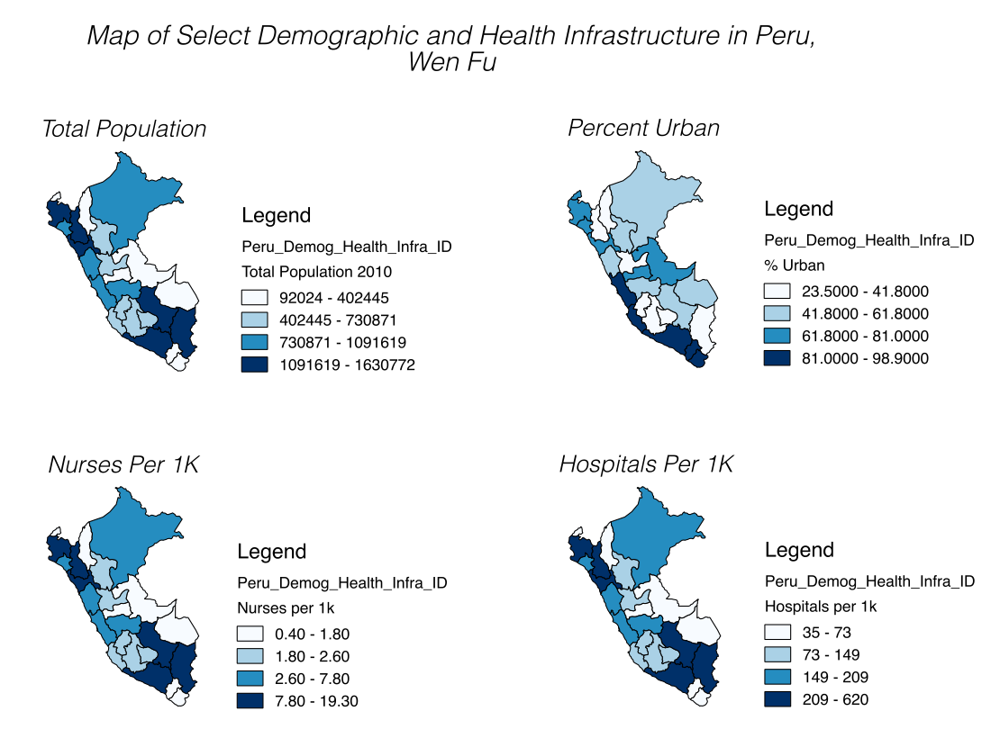
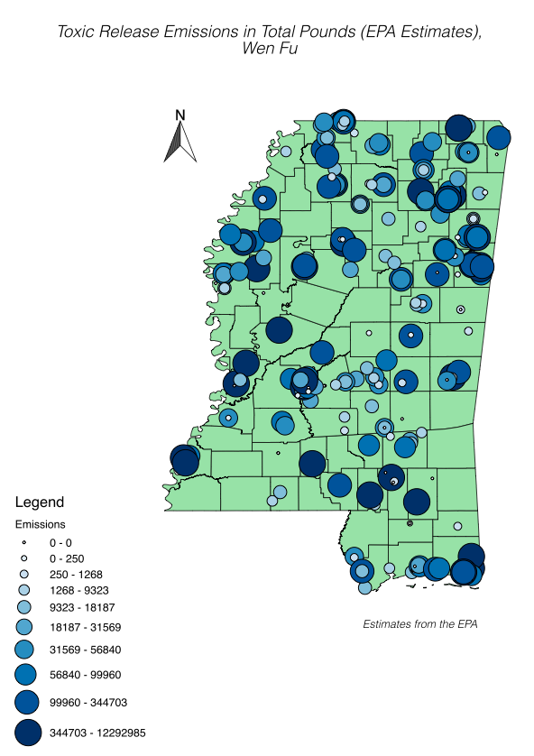
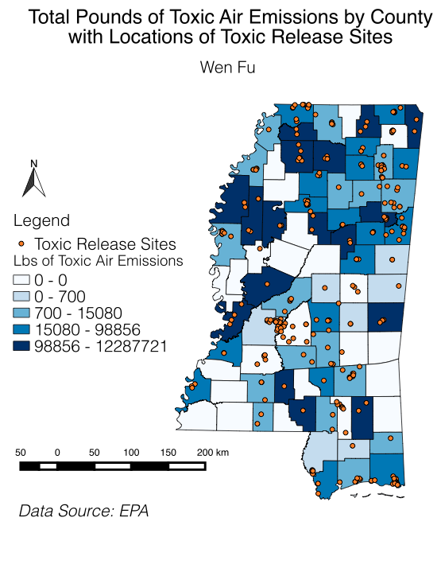
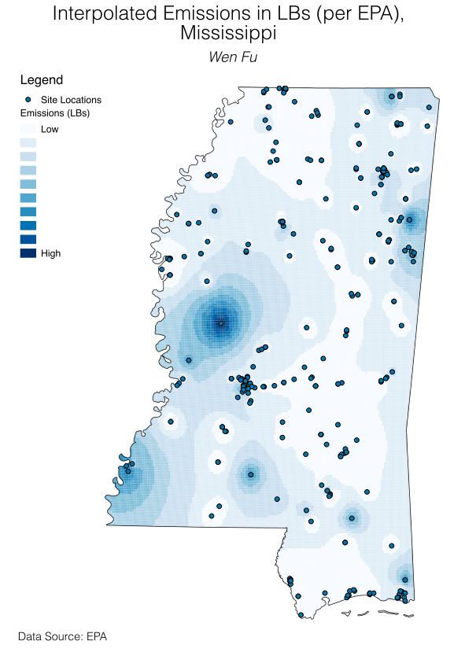
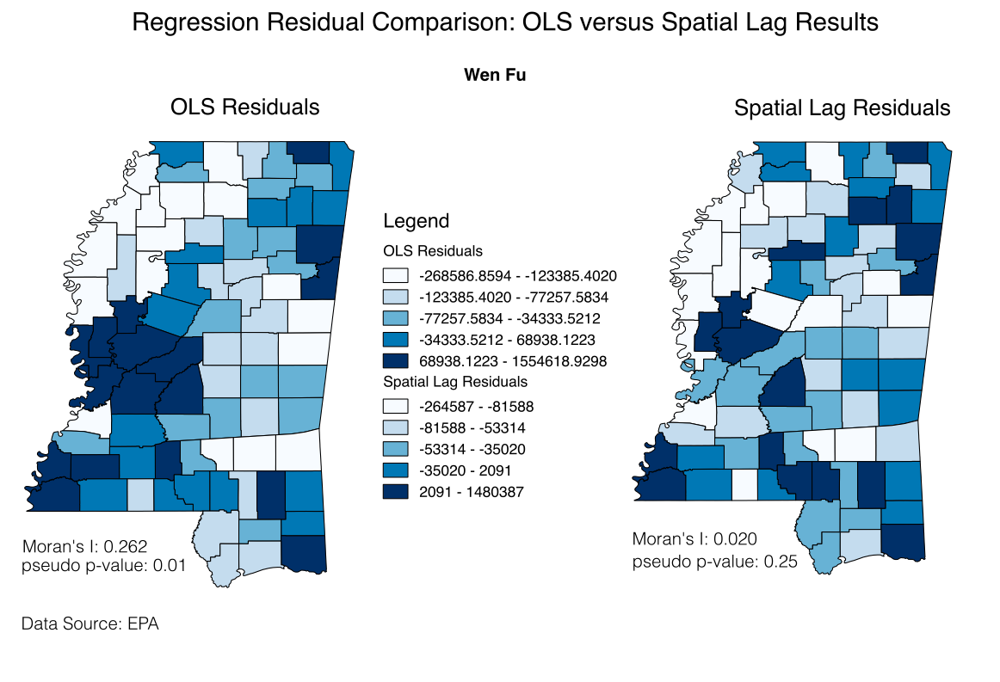
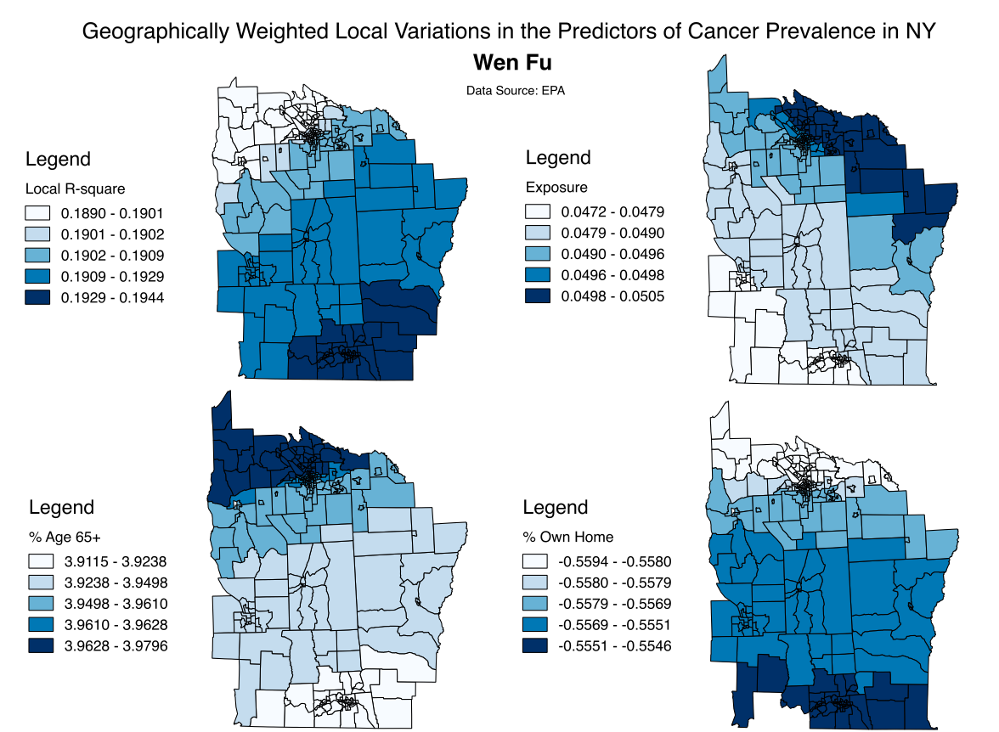
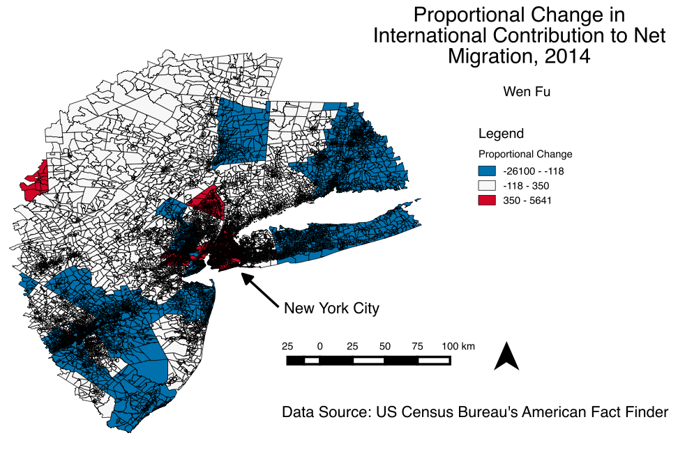

# List of Maps Created via QGIS

__1. Acquiring and making census data spatial__

Quantile of NYS population change using publicly available geographic shapefiles.

__2. Linking international geography data__

Quantile of health infrastructure data in panel layout.

__3. Creating spatial data from GPS coordinates__

Georeferenced point coverage of toxic emissions in Mississippi.

__4. Geocoding addresses__

Point data in address format geocoded to reflect toxic emission sites overlaying quantile of emission level.

__5. Point pattern interpolation (inverse distance weighting)__

Interpolating point-based emission level as spatially continuous surface.

__6. Exploratory spatial data analysis (spatial dependence detection)__

Spatial distribution and areas with significant clustering of emission level.

__7. Spatial regression (residual analysis)__

_Hypothesis: There is a social justice component to toxic emission levels._

Comparing residuals from regression models with and without control for spatial dependence.

__8. Testing and visualizing non-stationarity__

Geographically varying r-square indicating spatial nonstationarity for cancer prevalence predictors in NYS.

__9. Geoprocessing tools (creating buffer)__

International migration trend in NYC with buffer (100-mile commuting zone).

