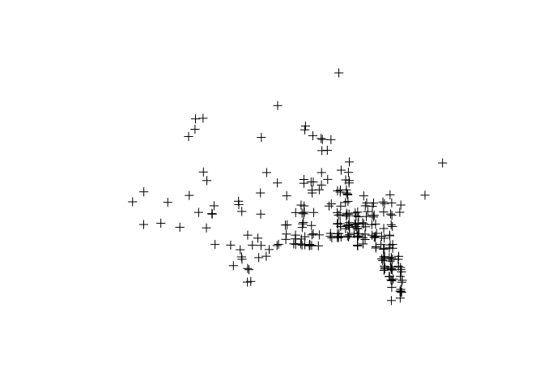
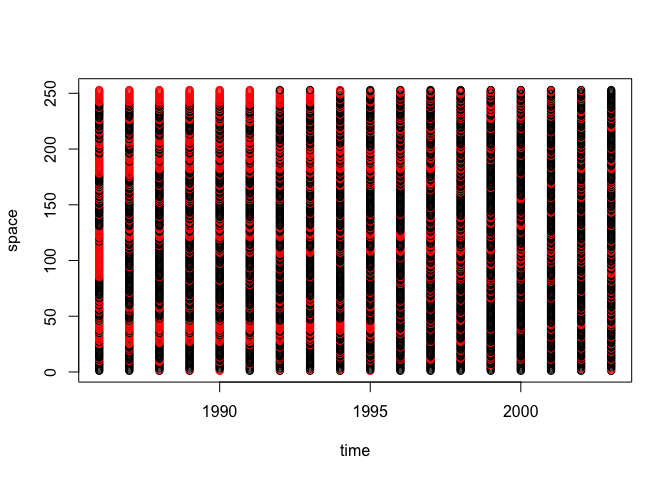
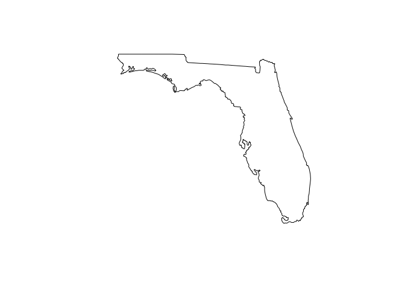
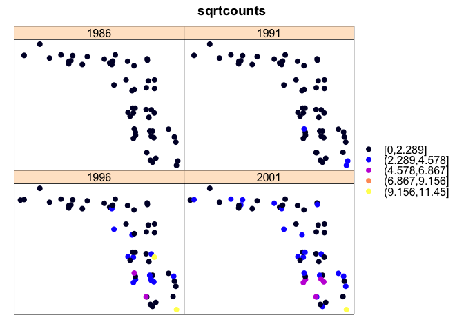
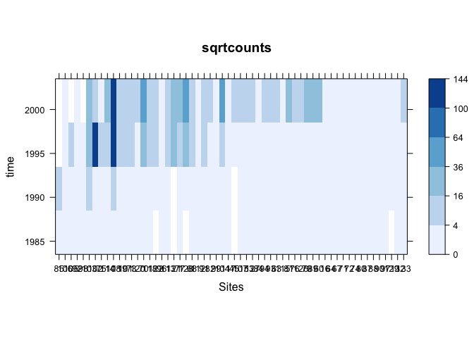
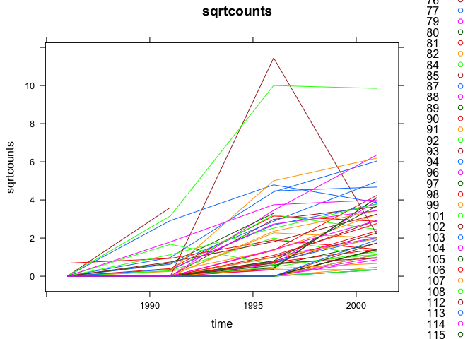
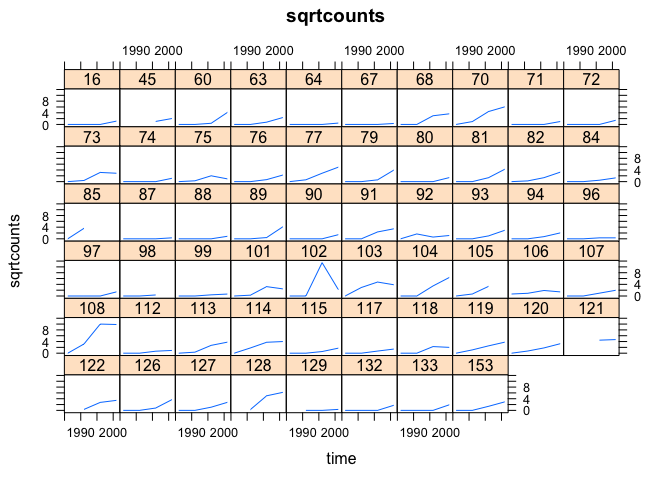

# Space-Time Patterns in R
Wen Fu  
May 23, 2016  
This lab sets up a space-time object in R and examines different ways to explore and visualize the spatio-temporal relationships in the data. 

Data: Breeding Bird Survey;
This lab: The count of Eurasian Collared Dove observed in Florida between 1986 and 2003

Load packages.

```r
suppressPackageStartupMessages(library(sp))
suppressPackageStartupMessages(library(xts))
suppressPackageStartupMessages(library(rgdal))
suppressPackageStartupMessages(library(maps))
suppressPackageStartupMessages(library(maptools))
suppressPackageStartupMessages(library(spacetime))
suppressPackageStartupMessages(library(RColorBrewer))
```

First import the spatial locations of bird observations by reading in the lat/long from the data table. Convert the table to a SpatialPoints object. Plot the physical locations of the dove observations.

```r
bird <- as.matrix(read.table("ECDovelatlon.dat", header = F))
dim(bird)
```

```
## [1] 253   2
```

```r
bird <- SpatialPoints(bird[, c(2, 1)])
proj4string(bird) <- CRS("+proj=longlat +datum=WGS84") # need the exact spacing in the argument
plot(bird)
```



Next set the date frame for the data.

```r
bird.yrs <- 1986:2003
bird.y <- as.Date(paste(bird.yrs, "-01-01", sep = ""), "%Y-%m-%d")
```

Read the actual observation data and create a Space-Time object (STFDF). This class has a n by m grid: n spatial locations and m times.

```r
bdata <- read.table("ECDoveBBS1986_2003.dat", header = F)
dim(bdata)
```

```
## [1] 253  18
```

```r
bdata[bdata == -1] <- NA
bdata.st <- STFDF(bird, bird.y, data.frame(counts = as.vector(as.matrix(bdata))))
```

The plot of the space-time object has information on both time (x-axis) and space (y-axis).

```r
plot(bdata.st)
```



```r
dim(bdata.st)
```

```
##     space      time variables 
##       253        18         1
```

There is one variable (count of bird observations), across 18 time intervals and 253 spatial locations.

Now take a closer look at the state of Florida by reading the state border of Florida.

```r
m <- map("state", "florida", fill = TRUE, plot = FALSE) # border points lat/long
FL <- map2SpatialPolygons(m, "FL")
proj4string(FL) <- proj4string(bdata.st) # use the same projection created
plot(FL)
```



Check the dimension of multiple aggregation functions.

```r
dim(bdata.st[FL, ])
```

```
##     space      time variables 
##        58        18         1
```

```r
dim(bdata.st[, "1998::2003"])
```

```
##     space      time variables 
##       253         6         1
```

```r
dim(bdata.st[,, "counts"])
```

```
##     space      time variables 
##       253        18         1
```

```r
dim(bdata.st[FL, "1998::2003", "counts"])
```

```
##     space      time variables 
##        58         6         1
```

Now counts are space- and time-restricted to Florida between 1998 and 2003.

To aggregate data, first produce a squared version of the count variable in order to maximize variation.

```r
bdata.st$sqrtcounts <- sqrt(bdata.st$counts)
```

Use an overlay (over) to match data on the space-time geometries specified.

```r
bb <- STF(FL, bird.y[c(4,6,8,10,12)]) # aggregate the data to Florida in 2-year intervals as an example
over(bb, bdata.st, fn = sum, na.rm = TRUE)
```

```
##   counts sqrtcounts
## 1      3   1.732051
## 2      5   4.414214
## 3     92  37.404228
## 4    176  64.018950
## 5    860 202.209044
```

Assign attributes to the new space-time object.

```r
b.counts <- new("STFDF", bb, data = over(bb, bdata.st, fn = sum, na.rm = TRUE))
# alternatively
# aggregate(bdata.st, bb, sum, na.rm = TRUE)
```

In this lab, aggregatae bird observations to 5-year intervals. Then select squared counts only in Florida.

```r
bird.5y <- aggregate(bdata.st, "5 years", mean, na.rm = TRUE)
bird.fl <- bird.5y[FL,, "sqrtcounts"]
x <- as(bird.fl, "xts")
x[is.na(x)] <- 0
```

Plot in lattice and animated forms.

```r
stplot(bird.fl, cuts = 5, animate = 0)
```



```r
# stplot(bird.fl, cuts = 5, animate = 1) 
# press ESC to stop animation
```

Another approach to exploring the data is to examine the weighted mean time count, which measures abundance and early presence of the birds.

```r
o <- order(as.vector(1:4 %*% x) / apply(x, 2, sum))
```

Use a Hovmoller diagram to display the weighted mean time count.

```r
pal <- brewer.pal(6, "Blues")
cuts <- c(0, 2, 4, 6, 8, 10, 12)
ck <- list(at = cuts, labels = as.character(cuts^2))
stplot(bird.fl[o, ], mode = "xt", col.regions = pal, cuts = 6, asp = 0.5, xlab = "Sites", colorkey = ck)
```



The plot shows an increasing sighting of birds as time progresses (upward on the diagram).

The counts can also be examined over time.

```r
stplot(bird.fl, mode = "ts")
```



And also a location-specific lattice plot of temporal trends.

```r
stplot(bird.fl, mode = "tp")
```



