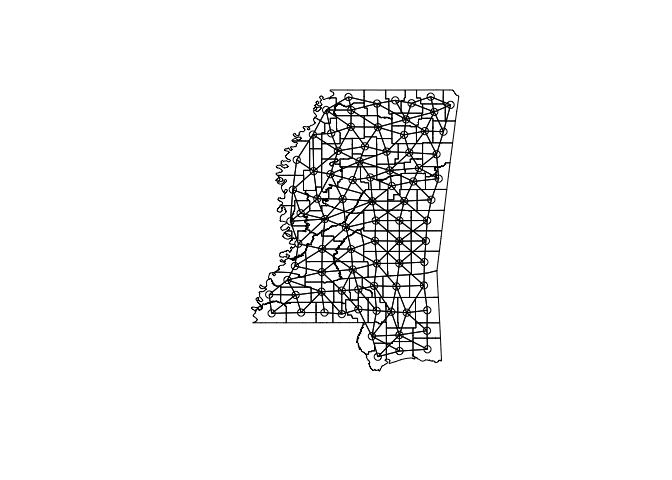
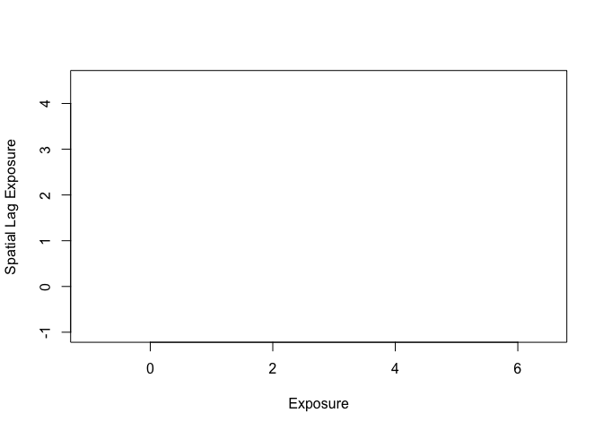
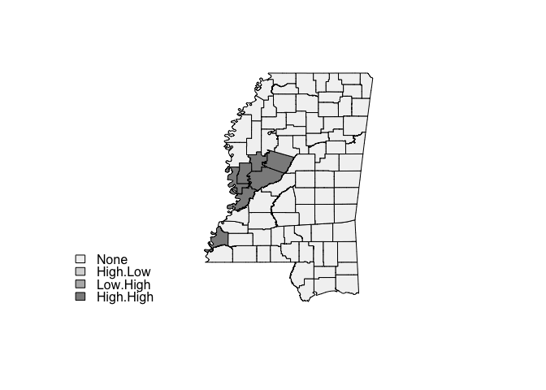

# Spatial Regression in R
Wen Fu  
April 24, 2016  
This lab examines the relationship between population characteristics and exposure to toxic releases in Mississippi (county-level). 


```r
suppressPackageStartupMessages(library(spdep))
suppressPackageStartupMessages(library(maptools))
suppressPackageStartupMessages(library(rgdal))
```

Read shapefile into R as polygons. Dependent variable is "Exposure", independent variables are % high-school dropout ("HS_DO"), % unemployed ("UNEMP"), % poverty ("POV") and % black ("PBLK").

```r
TRI_poly <- readShapeSpatial("TRI_REG")
names(TRI_poly)
```

```
##  [1] "AREA"       "PERIMETER"  "CO28_D00_"  "CO28_D00_I" "STATE"     
##  [6] "COUNTY"     "NAME"       "LSAD"       "LSAD_TRANS" "TRIcount"  
## [11] "TRIsum"     "TRImean"    "HS_DO"      "UNEMP"      "POV"       
## [16] "PBLK"       "Exposure"   "MS_County_" "MS_Count_1" "MS_Count_2"
## [21] "MS_Count_3" "MS_Count_4" "MS_Count_5" "MS_Count_6"
```

Given county-level data, an assumption is to use contiguity-based queen matrix as the proper weighting scheme which is created below.

```r
TRI_nbq <- poly2nb(TRI_poly)
```

To visualize the connectivity between each county and its neighbors, extract centroids and plot the weight matrix by these coordinates.

```r
coords <- coordinates(TRI_poly)
plot(TRI_poly)
plot(TRI_nbq, coords, add = T)
```



Summarize the weight matrix.

```r
summary(TRI_nbq)
```

```
## Neighbour list object:
## Number of regions: 82 
## Number of nonzero links: 432 
## Percentage nonzero weights: 6.424747 
## Average number of links: 5.268293 
## Link number distribution:
## 
##  3  4  5  6  7  8  9 
## 11 14 20 20 14  2  1 
## 11 least connected regions:
## 0 2 3 5 20 64 67 72 74 79 81 with 3 links
## 1 most connected region:
## 38 with 9 links
```

To proceed in spatial dependence tests and spatial regression, convert the matrix to a list.

```r
TRI_nbq_w <- nb2listw(TRI_nbq)
```

Test for spatial dependence in the Exposure variable, using Moran's I test, with the weights list. The result indicates there exists positive spatial dependence - clusters of high and low toxic release exposure in MS at the county level.

```r
moran.test(TRI_poly$Exposure, listw = TRI_nbq_w)
```

```
## 
## 	Moran I test under randomisation
## 
## data:  TRI_poly$Exposure  
## weights: TRI_nbq_w  
## 
## Moran I statistic standard deviate = 6.787, p-value = 5.725e-12
## alternative hypothesis: greater
## sample estimates:
## Moran I statistic       Expectation          Variance 
##       0.370018208      -0.012345679       0.003173939
```

To identify the local clusters, first produce the local I coefficients and p-values for each county. The resulting list indicates the observed and expected values of I with the p-values. Spatial cluster of exposure exists where the observed local I deviates significantly from the expected value.

```r
summary(TRI_poly$COUNTY)
```

```
## 001 003 005 007 009 011 013 015 017 019 021 023 025 027 029 031 033 035 
##   1   1   1   1   1   1   1   1   1   1   1   1   1   1   1   1   1   1 
## 037 039 041 043 045 047 049 051 053 055 057 059 061 063 065 067 069 071 
##   1   1   1   1   1   1   1   1   1   1   1   1   1   1   1   1   1   1 
## 073 075 077 079 081 083 085 087 089 091 093 095 097 099 101 103 105 107 
##   1   1   1   1   1   1   1   1   1   1   1   1   1   1   1   1   1   1 
## 109 111 113 115 117 119 121 123 125 127 129 131 133 135 137 139 141 143 
##   1   1   1   1   1   1   1   1   1   1   1   1   1   1   1   1   1   1 
## 145 147 149 151 153 155 157 159 161 163 
##   1   1   1   1   1   1   1   1   1   1
```

```r
fips <- order(TRI_poly$COUNTY)
locI <- localmoran(TRI_poly$Exposure, TRI_nbq_w)
printCoefmat(data.frame(locI[fips, ], row.names = TRI_poly$COUNTY[fips]), check.names = FALSE)
```

```
##             Ii       E.Ii     Var.Ii       Z.Ii Pr.z...0.
## 001  2.1728484 -0.0123457  0.2257766  4.5988640    0.0000
## 003 -0.1519486 -0.0123457  0.2257766 -0.2938022    0.6155
## 005  0.0076003 -0.0123457  0.1681653  0.0486394    0.4806
## 007 -0.0986568 -0.0123457  0.0721465 -0.3213360    0.6260
## 009  0.1535005 -0.0123457  0.2257766  0.3490326    0.3635
## 011  0.1199860 -0.0123457  0.2257766  0.2784995    0.3903
## 013  0.1484782 -0.0123457  0.1105540  0.4836859    0.3143
## 015 -0.0025643 -0.0123457  0.1335985  0.0267607    0.4893
## 017  0.0231577 -0.0123457  0.1105540  0.1067781    0.4575
## 019  0.1766409 -0.0123457  0.1335985  0.5170471    0.3026
## 021 -0.0376328 -0.0123457  0.1681653 -0.0616640    0.5246
## 023  0.1880503 -0.0123457  0.1681653  0.4886757    0.3125
## 025 -0.0190477 -0.0123457  0.1335985 -0.0183360    0.5073
## 027  0.1907751 -0.0123457  0.1335985  0.5557169    0.2892
## 029 -0.0340101 -0.0123457  0.0940936 -0.0706264    0.5282
## 031  0.1700891 -0.0123457  0.1105540  0.5486817    0.2916
## 033  0.3532384 -0.0123457  0.2257766  0.7693924    0.2208
## 035  0.1233309 -0.0123457  0.1105540  0.4080540    0.3416
## 037  0.3456454 -0.0123457  0.1335985  0.9794254    0.1637
## 039  0.0532192 -0.0123457  0.1681653  0.1598833    0.4365
## 041  0.0693050 -0.0123457  0.2257766  0.1718385    0.4318
## 043  0.0513980 -0.0123457  0.0940936  0.2078053    0.4177
## 045  0.3589938 -0.0123457  0.2257766  0.7815050    0.2173
## 047  0.2581918 -0.0123457  0.1681653  0.6597195    0.2547
## 049  0.2699666 -0.0123457  0.0940936  0.9203430    0.1787
## 051  1.2858811 -0.0123457  0.1105540  3.9044813    0.0000
## 053  4.0408979 -0.0123457  0.1105540 12.1903305    0.0000
## 055  2.0602006 -0.0123457  0.1681653  5.0540096    0.0000
## 057 -0.0137303 -0.0123457  0.1681653 -0.0033766    0.5013
## 059 -0.0570369 -0.0123457  0.2257766 -0.0940553    0.5375
## 061  0.3085093 -0.0123457  0.0940936  1.0459929    0.1478
## 063  0.2629571 -0.0123457  0.1335985  0.7531990    0.2257
## 065 -0.0031918 -0.0123457  0.1335985  0.0250440    0.4900
## 067  0.2566959 -0.0123457  0.1105540  0.8091559    0.2092
## 069  0.1589005 -0.0123457  0.1335985  0.4685113    0.3197
## 071  0.2451113 -0.0123457  0.0940936  0.8393143    0.2006
## 073  0.0601082 -0.0123457  0.1335985  0.1982260    0.4214
## 075  0.1492360 -0.0123457  0.1335985  0.4420704    0.3292
## 077 -0.1491783 -0.0123457  0.1105540 -0.4115308    0.6597
## 079  0.1528285 -0.0123457  0.1105540  0.4967696    0.3097
## 081  0.0139607 -0.0123457  0.1105540  0.0791177    0.4685
## 083  0.0093256 -0.0123457  0.1105540  0.0651775    0.4740
## 085 -0.0441908 -0.0123457  0.0940936 -0.1038157    0.5413
## 087  0.0269867 -0.0123457  0.1681653  0.0959141    0.4618
## 089  0.0070417 -0.0123457  0.0940936  0.0632033    0.4748
## 091  0.0036856 -0.0123457  0.1335985  0.0438598    0.4825
## 093  0.2966227 -0.0123457  0.1335985  0.8453045    0.1990
## 095 -0.0183660 -0.0123457  0.1335985 -0.0164710    0.5066
## 097  0.0867198 -0.0123457  0.1335985  0.2710326    0.3932
## 099  0.1939864 -0.0123457  0.1105540  0.6205538    0.2674
## 101  0.2488470 -0.0123457  0.0817484  0.9135271    0.1805
## 103  0.0307727 -0.0123457  0.1681653  0.1051463    0.4581
## 105  0.0714823 -0.0123457  0.1105540  0.2521166    0.4005
## 107  0.2332978 -0.0123457  0.1105540  0.7387850    0.2300
## 109  0.1961084 -0.0123457  0.1105540  0.6269360    0.2654
## 111 -0.0350245 -0.0123457  0.1105540 -0.0682076    0.5272
## 113  0.0176264 -0.0123457  0.2257766  0.0630778    0.4749
## 115  0.0838738 -0.0123457  0.1335985  0.2632464    0.3962
## 117  0.0426493 -0.0123457  0.1105540  0.1654001    0.4343
## 119  0.1928431 -0.0123457  0.1681653  0.5003634    0.3084
## 121  0.0823900 -0.0123457  0.1105540  0.2849222    0.3879
## 123  0.2456227 -0.0123457  0.1105540  0.7758527    0.2189
## 125  4.1372206 -0.0123457  0.1681653 10.1189285    0.0000
## 127  0.0143023 -0.0123457  0.0940936  0.0868729    0.4654
## 129  0.2965212 -0.0123457  0.0940936  1.0069113    0.1570
## 131  0.1682667 -0.0123457  0.0940936  0.5887993    0.2780
## 133 -0.0248275 -0.0123457  0.1105540 -0.0375396    0.5150
## 135  0.0837476 -0.0123457  0.0940936  0.3132659    0.3770
## 137  0.2605974 -0.0123457  0.1335985  0.7467431    0.2276
## 139  0.0413738 -0.0123457  0.1681653  0.1309976    0.4479
## 141  0.0042970 -0.0123457  0.2257766  0.0350254    0.4860
## 143  0.2855967 -0.0123457  0.1335985  0.8151385    0.2075
## 145  0.1436368 -0.0123457  0.0940936  0.5085055    0.3055
## 147  0.0080576 -0.0123457  0.1681653  0.0497545    0.4802
## 149  1.5098156 -0.0123457  0.1681653  3.7118678    0.0001
## 151 -0.3229037 -0.0123457  0.1335985 -0.8496538    0.8022
## 153  0.1636373 -0.0123457  0.1335985  0.4814708    0.3151
## 155  0.1494684 -0.0123457  0.0940936  0.5275168    0.2989
## 157  1.4880554 -0.0123457  0.2257766  3.1576787    0.0008
## 159  0.1882965 -0.0123457  0.0940936  0.6540969    0.2565
## 161  0.1792106 -0.0123457  0.1335985  0.5240776    0.3001
## 163  5.9321169 -0.0123457  0.0817484 20.7908905    0.0000
```

Visualize a map of significant high clusters of exposure.

```r
LocI <- moran.plot(TRI_poly$Exposure, TRI_nbq_w, labels = as.character(TRI_poly$NAME), xlim = c(-1, 6.5), ylim = c(-1, 4.5), xlab = "Exposure", ylab = "Spatial Lag Exposure")
```



```r
infl <- apply(LocI$is.inf, 1, any)
x <- TRI_poly$Exposure
lhx <- cut(x, breaks = c(min(x), mean(x), max(x)), labels = c("Low", "High"), include.lowest = TRUE)
wx <- lag(TRI_nbq_w, TRI_poly$Exposure)
lhwx <- cut(wx, breaks = c(min(wx), mean(wx), max(wx)), labels = c("Low", "High"), include.lowest = TRUE)
lhlh <- interaction(lhx, lhwx, infl, drop = FALSE)
cols <- rep(1, length(lhlh))
cols[lhlh == "High.Low.TRUE"] <- 2
cols[lhlh == "Low.High.TRUE"] <- 3
cols[lhlh == "High.High.TRUE"] <- 4
plot(TRI_poly, col = grey.colors(4, 0.95, 0.55, 2.2)[cols])
legend("bottomleft", legend = c("None", "High.Low", "Low.High", "High.High"), fill = grey.colors(4, 0.95, 0.55, 2.2), bty = "n", y.intersp = 0.8)
```



With spatial dependence identified, proceed to spatial regression modeling. Result shows that unemployment rate is the only significant effect.

```r
TRI.lm <- lm(Exposure ~ HS_DO + UNEMP + POV + PBLK, data = TRI_poly)
summary(TRI.lm)
```

```
## 
## Call:
## lm(formula = Exposure ~ HS_DO + UNEMP + POV + PBLK, data = TRI_poly)
## 
## Residuals:
##     Min      1Q  Median      3Q     Max 
## -340439  -98276  -33611   60596 1374012 
## 
## Coefficients:
##              Estimate Std. Error t value Pr(>|t|)   
## (Intercept)  43464.85  111855.19   0.389  0.69866   
## HS_DO       -16430.32    8914.75  -1.843  0.06917 . 
## UNEMP        27403.47   10093.50   2.715  0.00818 **
## POV           4488.06    6663.62   0.674  0.50263   
## PBLK           -36.82    2091.54  -0.018  0.98600   
## ---
## Signif. codes:  0 '***' 0.001 '**' 0.01 '*' 0.05 '.' 0.1 ' ' 1
## 
## Residual standard error: 226300 on 77 degrees of freedom
## Multiple R-squared:  0.1938,	Adjusted R-squared:  0.1519 
## F-statistic: 4.627 on 4 and 77 DF,  p-value: 0.002116
```

Specify and view the Lagrange Multiplier tests. Results show that both the LMerr and LMlag models capture the process of spatial dependence in the data, but that the robust forms of both are insignificant. Also, the SARMA model indicates that both lag (substantive lag effects) and error (error term structural inconsistency) forms of spatial dependence exist in the data.

```r
TRI.lagrange <- lm.LMtests(TRI.lm, TRI_nbq_w, test = c("LMerr", "RLMerr", "LMlag", "RLMlag", "SARMA"))
print(TRI.lagrange)
```

```
## 
## 	Lagrange multiplier diagnostics for spatial dependence
## 
## data:  
## model: lm(formula = Exposure ~ HS_DO + UNEMP + POV + PBLK, data =
## TRI_poly)
## weights: TRI_nbq_w
## 
## LMerr = 12.236, df = 1, p-value = 0.0004687
## 
## 
## 	Lagrange multiplier diagnostics for spatial dependence
## 
## data:  
## model: lm(formula = Exposure ~ HS_DO + UNEMP + POV + PBLK, data =
## TRI_poly)
## weights: TRI_nbq_w
## 
## RLMerr = 0.039649, df = 1, p-value = 0.8422
## 
## 
## 	Lagrange multiplier diagnostics for spatial dependence
## 
## data:  
## model: lm(formula = Exposure ~ HS_DO + UNEMP + POV + PBLK, data =
## TRI_poly)
## weights: TRI_nbq_w
## 
## LMlag = 14.216, df = 1, p-value = 0.000163
## 
## 
## 	Lagrange multiplier diagnostics for spatial dependence
## 
## data:  
## model: lm(formula = Exposure ~ HS_DO + UNEMP + POV + PBLK, data =
## TRI_poly)
## weights: TRI_nbq_w
## 
## RLMlag = 2.0198, df = 1, p-value = 0.1553
## 
## 
## 	Lagrange multiplier diagnostics for spatial dependence
## 
## data:  
## model: lm(formula = Exposure ~ HS_DO + UNEMP + POV + PBLK, data =
## TRI_poly)
## weights: TRI_nbq_w
## 
## SARMA = 14.256, df = 2, p-value = 0.0008024
```

Further examine the spatial lag model. The spatial lag parameter (Rho) of 0.49 is significant, meaning the average local exposure levels increase the local county's level of exposure by half a unit for each unit increase in the spatial lag exposure levels. Again, only unemployment is significantly associated with exposure.

```r
TRI.lag <- lagsarlm(Exposure ~ HS_DO + UNEMP + POV + PBLK, data = TRI_poly, TRI_nbq_w)
```

```
## Warning in lagsarlm(Exposure ~ HS_DO + UNEMP + POV + PBLK, data = TRI_poly, : inversion of asymptotic covariance matrix failed for tol.solve = 1e-10 
##   reciprocal condition number = 1.41714e-22 - using numerical Hessian.
```

```r
summary(TRI.lag)
```

```
## 
## Call:
## lagsarlm(formula = Exposure ~ HS_DO + UNEMP + POV + PBLK, data = TRI_poly, 
##     listw = TRI_nbq_w)
## 
## Residuals:
##     Min      1Q  Median      3Q     Max 
## -362587  -75939  -26241   20010 1348739 
## 
## Type: lag 
## Coefficients: (numerical Hessian approximate standard errors) 
##              Estimate Std. Error z value Pr(>|z|)
## (Intercept)  20520.69   97400.40  0.2107  0.83313
## HS_DO       -12334.74    7960.94 -1.5494  0.12128
## UNEMP        21025.11    8975.63  2.3425  0.01916
## POV           2599.14    5931.83  0.4382  0.66126
## PBLK          -774.45    1868.13 -0.4146  0.67846
## 
## Rho: 0.48595, LR test value: 12.341, p-value: 0.00044308
## Approximate (numerical Hessian) standard error: 0.12387
##     z-value: 3.9229, p-value: 8.7478e-05
## Wald statistic: 15.389, p-value: 8.7478e-05
## 
## Log likelihood: -1118.646 for lag model
## ML residual variance (sigma squared): 3.9199e+10, (sigma: 197990)
## Number of observations: 82 
## Number of parameters estimated: 7 
## AIC: 2251.3, (AIC for lm: 2261.6)
```

Examine the spatial error model. The spatial lag parameter (Lambda) of 0.52 is significant, meaning that the average local residuals increase the local county's level of residual by half a unit for each unit increase in the spatial lag residual. Again, only unemployment is significantly associated with exposure.

```r
TRI.err <- errorsarlm(Exposure ~ HS_DO + UNEMP + POV + PBLK, data = TRI_poly, TRI_nbq_w)
```

```
## Warning in errorsarlm(Exposure ~ HS_DO + UNEMP + POV + PBLK, data = TRI_poly, : inversion of asymptotic covariance matrix failed for tol.solve = 1e-10 
##   reciprocal condition number = 3.63322e-22 - using numerical Hessian.
```

```r
summary(TRI.err)
```

```
## 
## Call:
## errorsarlm(formula = Exposure ~ HS_DO + UNEMP + POV + PBLK, data = TRI_poly, 
##     listw = TRI_nbq_w)
## 
## Residuals:
##     Min      1Q  Median      3Q     Max 
## -328964  -73290  -38442   28444 1335657 
## 
## Type: error 
## Coefficients: (asymptotic standard errors) 
##             Estimate Std. Error z value Pr(>|z|)
## (Intercept)  94473.2   116942.8  0.8079  0.41917
## HS_DO       -13814.0     8024.4 -1.7215  0.08516
## UNEMP        25551.4    10140.8  2.5197  0.01175
## POV           4084.8     5974.9  0.6837  0.49419
## PBLK         -1596.8     2108.9 -0.7572  0.44894
## 
## Lambda: 0.51602, LR test value: 11.573, p-value: 0.00066918
## Approximate (numerical Hessian) standard error: 0.13207
##     z-value: 3.9073, p-value: 9.3339e-05
## Wald statistic: 15.267, p-value: 9.3339e-05
## 
## Log likelihood: -1119.03 for error model
## ML residual variance (sigma squared): 3.9255e+10, (sigma: 198130)
## Number of observations: 82 
## Number of parameters estimated: 7 
## AIC: 2252.1, (AIC for lm: 2261.6)
```

The Lagrange test results indicate the spatial process is both lag and error related. Specify and view the mixed model. The results show that while controlling for the structural inconsistency of the correlated error term through the introduction of lagged independent variables, the spatial lag of the dependent variable is significant with a Rho of 0.47. So for each unit increase in exposure on average for neighbors, a local county's exposure increases by half a unit.

```r
TRI.durbin <- lagsarlm(Exposure ~ HS_DO + UNEMP + POV + PBLK, data = TRI_poly, TRI_nbq_w, type = "mixed")
```

```
## Warning in lagsarlm(Exposure ~ HS_DO + UNEMP + POV + PBLK, data = TRI_poly, : inversion of asymptotic covariance matrix failed for tol.solve = 1e-10 
##   reciprocal condition number = 1.43067e-22 - using numerical Hessian.
```

```r
summary(TRI.durbin)
```

```
## 
## Call:
## lagsarlm(formula = Exposure ~ HS_DO + UNEMP + POV + PBLK, data = TRI_poly, 
##     listw = TRI_nbq_w, type = "mixed")
## 
## Residuals:
##     Min      1Q  Median      3Q     Max 
## -362553  -89802  -32738   28044 1309641 
## 
## Type: mixed 
## Coefficients: (numerical Hessian approximate standard errors) 
##              Estimate Std. Error z value Pr(>|z|)
## (Intercept)  31556.35  167096.32  0.1889  0.85021
## HS_DO       -12033.83    8087.78 -1.4879  0.13678
## UNEMP        23990.51   10810.12  2.2193  0.02647
## POV           2790.79    5998.87  0.4652  0.64177
## PBLK         -2382.90    2203.10 -1.0816  0.27942
## lag.HS_DO    -2064.90   13609.04 -0.1517  0.87940
## lag.UNEMP    -9944.18   17281.08 -0.5754  0.56500
## lag.POV        563.71    6386.38  0.0883  0.92966
## lag.PBLK      3598.59    3082.31  1.1675  0.24301
## 
## Rho: 0.47077, LR test value: 10.102, p-value: 0.0014808
## Approximate (numerical Hessian) standard error: 0.12997
##     z-value: 3.6222, p-value: 0.00029206
## Wald statistic: 13.121, p-value: 0.00029206
## 
## Log likelihood: -1117.794 for mixed model
## ML residual variance (sigma squared): 3.8536e+10, (sigma: 196310)
## Number of observations: 82 
## Number of parameters estimated: 11 
## AIC: 2257.6, (AIC for lm: 2265.7)
```

